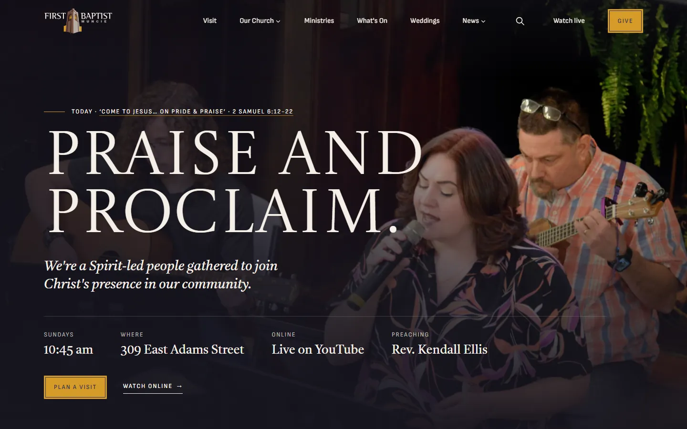
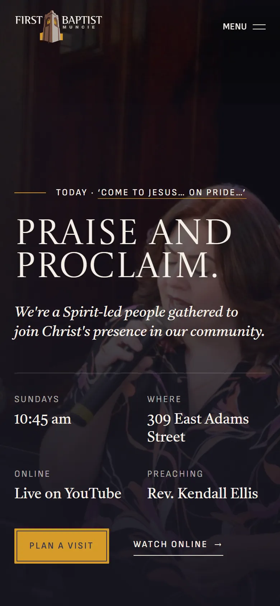
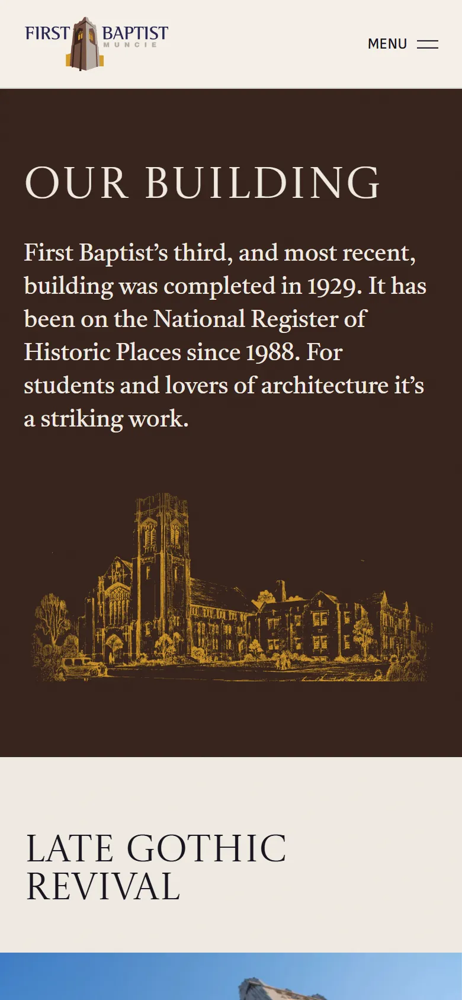
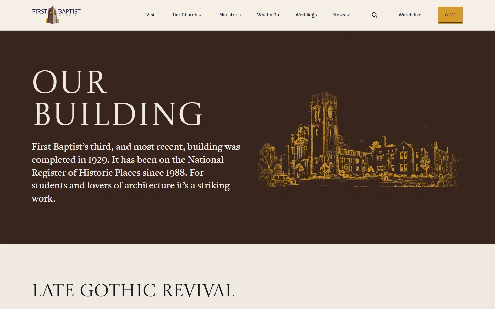

# First Baptist Church Muncie

A fast, editable, content-rich website for a historic Indiana church, replacing its Wix site with Astro, Sanity and Cloudflare Workers.

[](https://github.com/NateJ45/fbcm/actions/workflows/ci.yml)
[](https://fbcm-site.nathanjnixon86.workers.dev)




<p>
  
  
</p>



## What it is

The church's current site lives on Wix. This is the redesign: a static-first Astro site whose content lives in Sanity, so staff can edit pages on the page itself instead of fighting a site builder. It is built and deployed to a preview Worker at [fbcm-site.nathanjnixon86.workers.dev](https://fbcm-site.nathanjnixon86.workers.dev), with the cutover to the church's own domain pending the church. Until then, [www.fbcmuncie.org](https://www.fbcmuncie.org) is still the Wix site.

## Highlights

- **Full content migration.** 142 blog posts keep their original `/post/<slug>` URLs, alongside 17 staff, 5 ministries, a 138-photo library and 11 core pages, all moved into Sanity.
- **Page builder.** Every page is composed from Sanity sections through one renderer, and the embedded Studio at `/studio` offers a live draft preview.
- **Motion with restraint.** The Home hero is a slideshow of up to 12 photo frames, and headline words rise in one by one on page openers. Reduced-motion visitors get a still frame.
- **Light-only identity.** A church-specific brand system (arched frames, hairline layouts, a three-typeface stack) built for one theme, so every page is checked in one.
- **Church PDFs from R2.** The church's PDFs are fetched from Sanity once and cached in Cloudflare R2, so downloads stop costing CMS bandwidth.
- **Navigation and search.** A News dropdown and an in-site Pagefind search, loaded only when opened.
- **Quality gates in CI.** Type check, lint, Prettier, link check, Playwright (including axe accessibility runs) and Lighthouse on every change.

## Stack

Astro 7, TypeScript, Sanity v6, Tailwind 4, React 19 islands, Cloudflare Workers and R2, Playwright, Lighthouse CI.

Built by [Nixon Creative Studio](https://nixoncreativestudio.com).

---

## Developing

The website for First Baptist Church Muncie (309 East Adams Street, Muncie, IN 47305), built on **Astro + Sanity + Cloudflare Workers**. It was forked from [`ncs-astro-sanity-starter`](https://github.com/nixoncreativestudio) on 2026-09-18 and replaces the church's Wix site, carrying its 142 blog posts across at their original `/post/<slug>` URLs. The binding spec for the rebuild is `docs/superpowers/specs/2026-09-18-fbcm-rebuild-design.md`; read it before changing what the site is for.

Everything below this paragraph is still the starter's own README and is rewritten in plan 2. Where it says "the starter", read "this site's foundation".

---

## Why it exists

Every client project kept re-solving the same problems: a theme system, SEO, image handling, forms, a typed CMS layer, an editor guide, and a way to reskin the brand quickly. So those got extracted from a finished client build into one well-documented starting point. What is left for each new project is the part that should be unique: its brand identity and its content.

## What it is

**Page-builder-first.** The core pages (home, about, services, process) render from Sanity `pageBuilder` arrays through a shared `SectionRenderer`, and any page created in the Studio gets its own `/[slug]` route automatically. Editors compose pages from a palette of sections; no code changes to add or rearrange a page.

**Batteries included, opt-in.** The infrastructure is already standing: theme tokens with light and dark, SEO and structured data, an animation and polish layer, forms plumbing, image handling, a typed Sanity layer, and an in-Studio editor guide. Extra capabilities live in a **module library** you enable per project, so a site carries only what it uses.

**Edit on the page, not in a form.** The Sanity Studio is embedded at `/studio` and ships with a live draft preview: an editor picks a page from a list, sees it exactly as visitors will, clicks the words they want to change, and adds, duplicates, reorders or removes whole sections right on the page. Unpublished drafts stream in as they type. The public site stays fully static; the preview is the only part that runs server-side.

**A real adoption path.** A one-command brand reskin, a starter dataset seed, and a documented Foundation-vs-safe-to-edit taxonomy (which files need a planned session and which are safe to touch) mean a new build follows a runbook instead of guesswork. The gotchas that cost time in production are written down where you will hit them.

## Provenance

Extracted and genericized from a finished client build, and hardened across every project since. The lineage runs from a Reid Design build, through this starter, into the church and school sites the studio has shipped. It is not a minimal scaffold: it ships with the patterns and the documented landmines of real, live work.

---

## Stack

- **Astro 7** (static output plus a few SSR preview routes) + TypeScript strict mode
- **Sanity v6** headless CMS, Studio embedded at `/studio` (schemas in `src/sanity/schemaTypes/`)
- **Tailwind 4** via `@tailwindcss/vite` (brand tokens in `src/styles/globals.css`)
- **React 19** islands for interactivity; Astro components for everything static
- **shadcn/ui** primitives; **Cloudflare Workers** hosting via `npm run deploy`

## Getting started

**To adopt this for a new client, read [`docs/bootstrap/NEW-PROJECT.md`](docs/bootstrap/NEW-PROJECT.md) first.** It is the single entry point: identity setup, design reskin, module enable, seed, and deploy, in order. Read [`CLAUDE.md`](./CLAUDE.md) before changing anything for the Foundation taxonomy and code style.

```sh
npm install
npm run dev
```

A fresh clone builds and runs with no Sanity project at all: pages render their built-in default sections. To turn on the CMS and the live preview you need three things, all covered in `docs/bootstrap/NEW-PROJECT.md`:

1. `PUBLIC_SANITY_PROJECT_ID` in `.env` (see `.env.example`).
2. `SANITY_TOKEN` as a Worker runtime secret (see `.dev.vars.example`; `npx wrangler secret put SANITY_TOKEN` in production).
3. Your origins on the Sanity project's CORS allow list: `npx sanity cors add http://localhost:4321 --credentials`, and the same for the deployed URL.

Without steps 2 and 3 the public site is unaffected; only the embedded Studio and the preview are off, and the preview routes say so instead of erroring.

## Quality gates

Every site in this family runs the same checks, and a fork inherits them (PORTS.md card 35).

```sh
npm run check        # astro check + eslint
npm run check:full   # typegen + build + unit tests
npm run format:check # prettier
npm run check:links  # linkinator over dist/client
npm test             # Playwright: smoke, axe light, axe dark, reflow
npx lhci autorun     # Lighthouse against the built dist/client
```

`ci.yml` runs the first five as parallel jobs on every push and PR (static checks, one
build plus the link check, and Playwright in three shards that reuse that build);
`lighthouse.yml` runs the audit separately, on a path filter, sampling one URL per
template on a PR and the full list on `main` and weekly. Accessibility is a hard gate at 100, LCP 4500ms and CLS 0.1
are hard, performance / SEO / best-practices are warnings. The Playwright suites run on
Chromium and a real WebKit iPhone profile, because that is where a Tailwind focus ring
on a `<select>` turns out to be invisible.

Two more workflows ship dormant, gated on repo secrets and variables that do not exist
in the template: `sanity-backup.yml` (nightly encrypted dataset export) and `uptime.yml`
(hourly 200 check on four key pages). Set the secrets and uncomment the schedule to turn
either on. `publish-due.yml` works the same way.

---

Maintained by [Nixon Creative Studio](https://nixoncreativestudio.com).
